# WAX Tokenomics Upgrade
## Summary
WAX Blockchain tokenomics is being redesigned in order to reduce the on-chain inflation rate and to ensure that on-chain activities can start funding the cost associated with the wax blockchain chain operations.

Todays model utilizes static 5% yearly inflation to fund operations with 2% being used to pay block producers and standby producers, 2% being used to pay for rewards to users participating in chain governance via staking and voting and 1% being used to fund blockchain savings account used to pay for community projects via WAX Labs and other business development activities.

The execution engine of the wax blockchain that is responsible for pricing resources and metering the cost of transaction per user is based on a resource staking model. That model allows users to stake waxp to reserve CPU and NET bandwidths while also allowing them to purchase RAM storage. That reservation is then evaluated at runtime to determine how much each user’s stake can yield per block produced based on chain utilization at that time. In other words the same amount of stake can yield more bandwidth if the wax blockchain is not busy or it can yield less bandwidth during surge times. Users need to ensure that in order for them to perform operations reliably they have enough wax staked to match how busy the chain is. Resources stake is a renewable resource and consumed bandwidth goes on a 24h cooldown after which period is again available to a user.

Resource staking and wax blockchain transaction rate need to be correlated to on-chain inflation and operations cost. In theory, users having to stake waxp tokens for resources should create enough demand for waxp tokens to keep equilibrium between demand and supply as long as the chain transaction rate continues to increase. Due to the fact that resource stake is renewable, that rate of activity increase would have to generate enough demand for waxp staking to match the chain inflation rate in order to keep the equilibrium. However, during bear markets when activity decreases or remains constant the current resource staking model is not in equilibrium and tokens generated via inflation are not being consumed for resource staking.

This creates an environment where resources needed to execute a transaction are indirectly, heavily subsidized by inflation creating unnecessary waxp sell pressure in the ecosystem.

Current Tokenomics  


<ins>LEGEND</ins>  
1. Users stakes WAXP for NET and/or CPU bandwidth
2. Users execute a transaction
3. Execution engine calculates how many resources a user's current stake can provide in the context of a block produced; that stake is then consumed and put on 24h cooldown. Additionally if storage is needed for a transaction then the user's RAM is permanently consumed. Users can decide to delete resources later on freeing RAM and allowing for that RAM to be sold on an open RAM marketplace.
4. Each block triggers an Inflation Rewards mechanism that mints tokens and funds Voting Rewards, Producer rewards and Savings.
5. Users staked resources are taken off cooldown and available for usage again.
6. Users receive voting rewards equal to their voting power calculated based on their staked percentage.
7. Producer rewards are distributed to voted in Block Producers and Standby Producers
8. Projects and Business Development are funded from Savings

The WAX team is working on redesigning the current model by adding more parameters allowing calibration of the staked resource renewability mechanism. Additionally, new parameters will also be added to allow better algorithmic calibration of how much resource stake is needed to execute a transaction in correlation with on chain activity.

Also, WAX team is adding a pay per transaction model allowing users to perform transactions and fund them from existing resource stake. This new mechanism can be triggered when a user’s staked resource allowance is exhausted, and users have the ability to opt in to having transaction fees take over when their stakes resources max out. Transaction fee mechanism depletes users' resource stake over time as consumed transaction fees are not renewable. The benefit is to be able to execute transactions immediately once user’s original staked resource allowance is depleted.

Transaction fees collected are then fed into Rewards Computation engine that utilizes a variable inflation model to fund chain operations. If enough transaction fees are collected to cover chain operations then variable inflation goes to zero, however, if there is a shortfall then positive inflation is triggered to supplement the short fall up to 5% inflation. Similarly if transaction fees collected exceed the cost of chain operations then those tokens are burnt triggering a negative inflation.

This change to the tokenomics model is a first step to provide a stronger link between on-chain activity and chain operations costs with the ultimate goal being bringing wax blockchain inflation to zero or negative inflation.

Future Tokenomics  
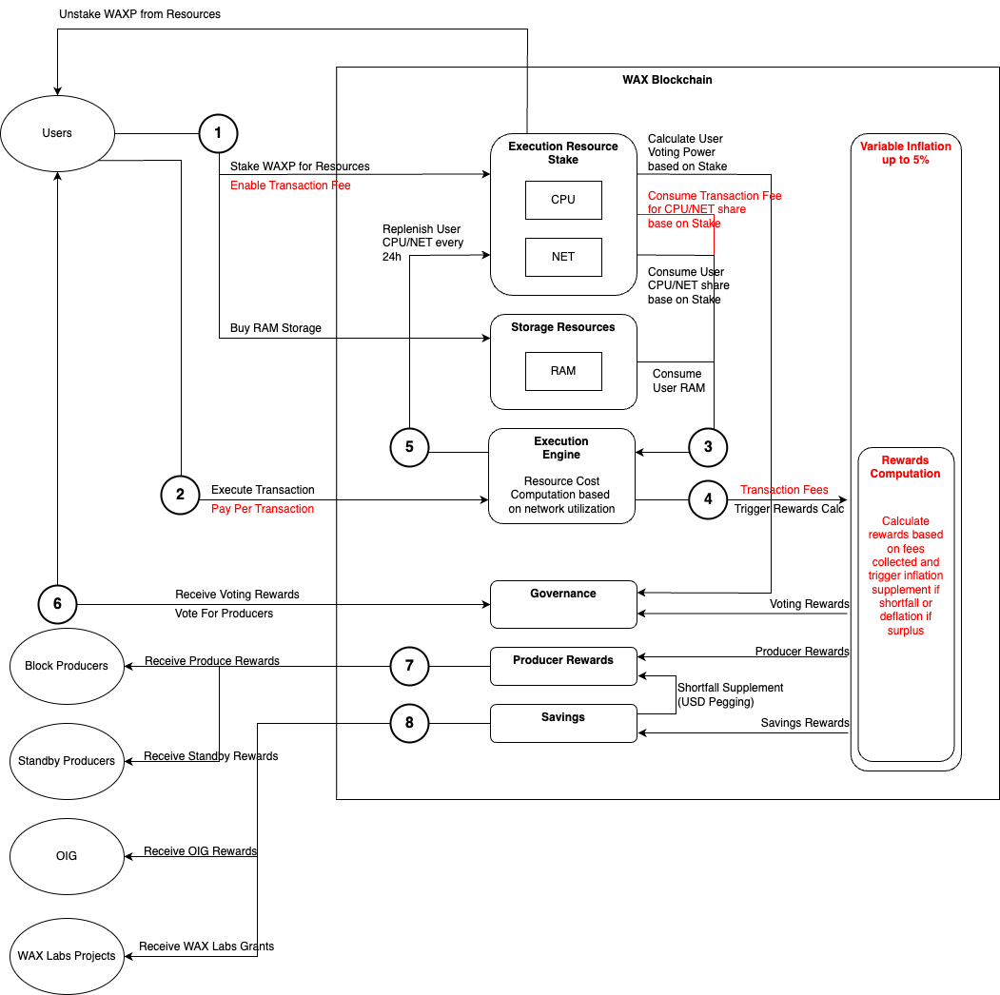

<ins>LEGEND</ins>  
1. Users stakes WAXP for NET and/or CPU bandwidth. Users then can designate maximum transaction fees they are willing to pay from stake in the future if they elect pay per transaction model.
2. Users execute a transaction and if enabled pay per transaction mechanism is triggered once users original stake allowance is depleted.
3. Execution engine calculates how many resources a user's current stake can provide in the context of a block produced; that stake is then consumed and put on 24h cooldown. If a user selects pay per transaction model then that stake is consumed permanently. Additionally if storage is needed for a transaction then the user's RAM is permanently consumed. Users can decide to delete resources later on freeing RAM and allowing for that RAM to be sold on an open RAM marketplace.
4. Each block triggers an Inflation Rewards mechanism and transfers collected transaction fees to the Rewards Computation engine. If enough transaction fees are collected to cover chain operations then variable inflation goes to zero, however, if there is a shortfall then positive inflation is triggered to supplement the short fall up to 5% inflation. Similarly if transaction fees collected exceed the cost of chain operations then those tokens are burnt triggering a negative inflation.
5. Users staked resources are taken off cooldown and available for usage again.
6. Users receive voting rewards equal to their voting power calculated based on their staked percentage.
7. Producer rewards are distributed to voted in Block Producers and Standby Producers
8. Projects and Business Development are funder from Savings

## Summary of Changes
1. Optional per transaction fee calculated by current chain activity and the transaction cpu/net resources consumed.
  * Fees are consumed directly from a user’s stake
  * Fees are only activated once a user has exceeded their usual WAX staking reserved bandwidth
  * Fee function is adjustable via 4 parameters at the system contract level, requiring eosio account authorization. Parameters to be described in the formula details section below:
    * cpu_fee_scaler
    * free_block_cpu_threshold
    * net_fee_scaler
    * free_block_net_threshold
2. Opt-in mechanic allowing users to set (via system contract)
  * A maximum acceptable per transaction fee, max_tx_fee.
    * A setting of zero indicates no limit to the per tx transaction fee allowed
  * Maximum total fees to draw from stake, max_fee
    * A setting of zero indicates no limit to the accumulated transaction fees allowed, up to the account’s total stake
3. Mechanism to sweep fees to a system account, eosio.txfee, whenever users adjust their stake values via delegatebw or undelegatebw

### Fee Function
The fee function is described below. See diagram below.
Logic to realize:
  * that fees are not charged UNTIL a user has exhausted their reserved resources from staking WAX.
  * if the fee calculated is greater than **max_tx_fee** for the account that is paying for resources, the transaction will be rejected.
  * if the fee calculated results in a current fees accumulated value greater than **max_fee** for the account that is paying for resources, the transaction will be rejected.
```
fee_cpu = cpu_fee_scaler * (1 / (max_block_cpu - ema_block_cpu) - 1 / (max_block_cpu - free_block_cpu_threshold)) * tx_cpu_consumption

fee_net = net_fee_scaler * (1 / (max_block_net - ema_block_net) - 1 / (max_block_net - free_block_net_threshold)) * tx_net_consumption

fee = MAX(0, fee_net) + MAX(0, fee_cpu)
```
where: 
  * **fee_cpu** is the fee charged against an actions cpu consumption
  * **cpu_fee_scaler** is a constant that will be massaged experimentally to give reasonable fee values once the free threshold is passed in the exponential block moving average
  * **max_block_cpu** is the maximum cpu permitted to be used in a block which is set via config already
  * **ema_block_cpu** is the exponential moving average of the current block cpu usage. This is updated for every block
  * **free_block_cpu_threshold** is the value of the exponential moving block value, ema_block_cpu_ratio, at which fees start being charged. This is a constant, which should be configurable via contract updates. This value will typically be set to 0
  * **tx_cpu_consumption** is the cpu consumption for this transaction which we are calculating fee charges for

The **net** labelled variables above are identical in purpose to the corresponding cpu ones. They are just expressing the same thing in terms of net rather than cpu. For completeness, here are there definitions:
  * **fee_net** is the fee charged against an actions net consumption
  * **net_fee_scaler** is a constant that will be massaged experimentally to give reasonable fee values once the free threshold is passed in the exponential block moving average
  * **max_block_net** is the maximum net permitted to be used in a block which is set via config already
  * **ema_block_net** is the exponential moving average of the current block net usage divided. This is updated for every block
  * **free_block_net_threshold** is the value of the exponential moving block value, ema_block_net_ratio, at which fees start being charged. . This is a constant, which should be configurable via contract updates. This value will typically be set to 0
  * **tx_net_consumption** is the net consumption for this transaction which we are calculating fee charges for

And finally,
  * **fee** is the final fee charged for this particular action

### Intuition diagram for fee function profile
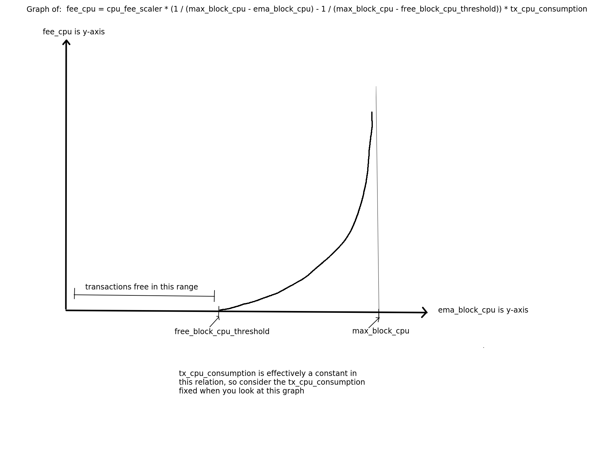  
This [spreadsheet](https://docs.google.com/spreadsheets/d/1VEmN37_BwFeNmm6TgAmjlNUPLtwnfm0_CyEPaby2bfg/edit#gid=1611017018) also models the fee function

## Code Changes
Core blockchain MR: https://github.com/worldwide-asset-exchange/wax-blockchain/pull/4  
System contracts MR: https://github.com/worldwide-asset-exchange/wax-system-contracts/pull/82  
CDT changes MR: https://github.com/worldwide-asset-exchange/cdt/pull/1  

**The core blockchain code** itself had to be adjusted to
1. Support the new method of transaction submission incorporating a potential fee to be collected at [here](../libraries/chain/resource_limits.cpp#L254)
2. Support the tracking of fees collected and allow the functions required to reset them and constrain user preferences for transaction fees at [here](../libraries/chain/include/eosio/chain/resource_limits_private.hpp#L352)
3. Place activation guards to ensure backwards compatibility with blocks that are pre tx fee activation. These changes will require a [hardfork](../libraries/chain/include/eosio/chain/protocol_feature_manager.hpp#L38)
  * Example guard at [here](../libraries/chain/controller.cpp#L1627)

**The contract development toolkit** had to be adjusted to allow the interface between the system contract code and the core blockchain which
1. Drives the fee collection logic
  * https://github.com/worldwide-asset-exchange/cdt/blob/wax-tokenomics/libraries/native/intrinsics.cpp#L917
  * https://github.com/worldwide-asset-exchange/cdt/blob/wax-tokenomics/libraries/native/intrinsics.cpp#L921
2. Permit users a method to adjust the transaction fee tolerances **max_tx_fee** and **max_fee**: 
  * https://github.com/worldwide-asset-exchange/cdt/blob/wax-tokenomics/libraries/native/intrinsics.cpp#L913
3. Permit the system account to adjust the transaction fee function parameters **cpu_fee_scaler**, **free_block_cpu_threshold**, **net_fee_scaler**, **free_block_net_threshold**:
  * https://github.com/worldwide-asset-exchange/cdt/blob/wax-tokenomics/libraries/native/intrinsics.cpp#L909

**The system contracts code** was adjusted to provide
1. Logic to allow the system account to adjust transaction fee function parameters:
  * Actions
    * **cfgfeeparams**: https://github.com/worldwide-asset-exchange/wax-system-contracts/blob/wax-tokenomics/contracts/eosio.system/src/delegate_bandwidth.cpp#L672
2. Logic to allow users access to their fee parameters via the follow actions
  * Actions
    * **configaccfee**: https://github.com/worldwide-asset-exchange/wax-system-contracts/blob/wax-tokenomics/contracts/eosio.system/src/delegate_bandwidth.cpp#L680
3. Logic to allow the transaction fees to be swept to the **eosio.txfee** account whenever a user adjusts their stake via the **delegatebw** or **undelegatebw** actions:
  * https://github.com/worldwide-asset-exchange/wax-system-contracts/blob/wax-tokenomics/contracts/eosio.system/src/delegate_bandwidth.cpp#L207
  * https://github.com/worldwide-asset-exchange/wax-system-contracts/blob/wax-tokenomics/contracts/eosio.system/src/delegate_bandwidth.cpp#L231

## Fee Scenarios
The following graph shows a pricing scheme that charges approximately one hundredth the WAX/CPU as the current staking parameters for the chain under typical daily load for July 2023, which is approximately 30ms avg per block, which yields a WAX/CPU cost of approximately 0.006 WAX/us  
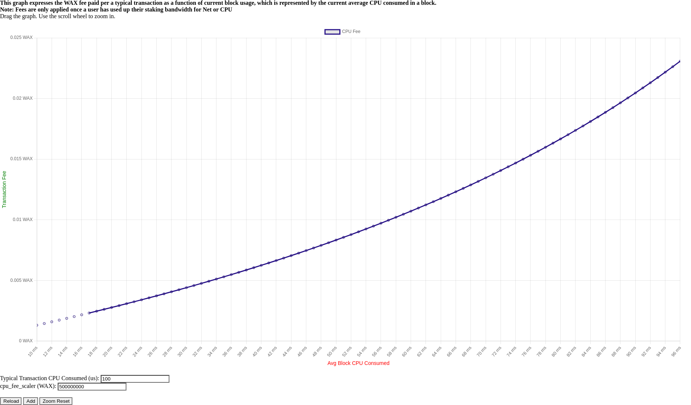

The diagram only shows the values up to a CPU load of 93ms/block (on average). Notice that the fees spike sharply as we get close to the maximum allowed CPU/block:  
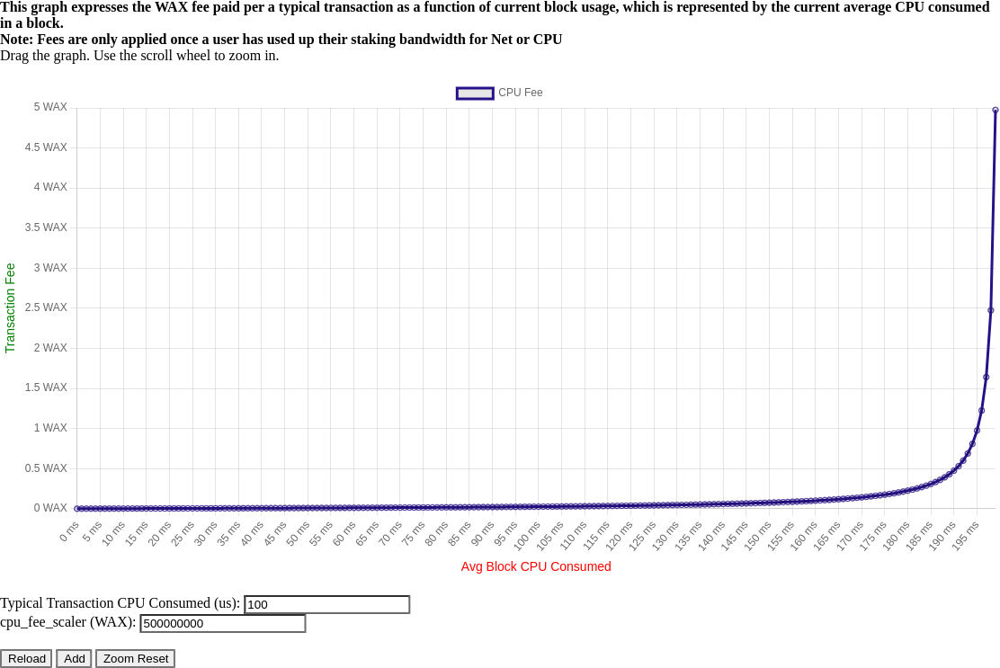

Looking at the first diagram, we see that the cost for a typical transaction using 100us CPU (about the same as a token transfer under current conditions) is about 0.004 WAX. A user would have to lock up 0.4 WAX under current conditions to make the same transfer.

If everyone using the chain decided to use transaction fees over stake (by using up their staking bandwidth), under current load, the chain would produce 30ms/100us = 300 transactions per block, yielding 1.2 WAX/block in fees, or approximately $400 USD per hour in fees at 5 cents per WAX.

There is likely some equilibrium between staking opportunity cost, fee cost, and current chain load that is also dependent on users’ tolerance for using either transaction funding mode. We can look to the transaction rate on this account for some idea of what that equilibrium might be: https://waxblock.io/account/txfee.wax since this is a year long history of users choosing to pay for their transaction once their resources are exhausted

The html for the graphs above can be found [here](../graphs/fee-profile.html)  
You can also work with it online [here](https://raw.githack.com/worldwide-asset-exchange/wax-blockchain/tokenomics-graphs/graphs/fee-profile.html)  

## Expanded Analysis of Projected Tokenomics
The html for the graphs below can be found [here](../graphs/stake-fee.html)  
You can try out the graph online [here](https://raw.githack.com/worldwide-asset-exchange/wax-blockchain/tokenomics-graphs/graphs/stake-fee.html)  

Before diving into the parameters of these charts let’s discuss a hidden mechanism of the WAX resource allocation system, the elastic multiplier. At its core, the elastic multiplier adjusts resource allocation based on recent network activity, aiming to maintain the network's CPU usage around the target utilization. If actual CPU usage (represented by the EMA Block CPU) is higher than the target (Target Block CPU Percent), the system will quickly decrease resource allocation to users, making it more expensive for them to execute transactions. Conversely, if the network is under-utilized, users are quickly granted more resources for the same amount of staked WAX. Below the target CPU usage (currently 25%), users will generally be allowed 1000 times more bandwidth access. Beyond the target, users quickly receive their natural allocation with a multiplier of 1.

### Chart Overview:
Each graph represents two lines plotted against time (in hours) x-axis spanning 120 hours.

**WAX Staked (WAX)**: The green line. This is a representation of the user's WAX balance staked over time, given their transaction behavior and any associated fees.  
**Available CPU (us)**: The red line. This denotes the available CPU time (in microseconds) for the user over time, considering their transactions and replenishment rate.  
#### Chart Input Parameters:
  * **Max Block CPU**: Represents the maximum CPU time that a block can be processed in microseconds. It's a global cap on how much CPU time a block can use. This is a fundamental constraint of the system and determines the total available CPU time for all transactions in a block. This value is fixed at 200000 microseconds, which is standard across EOSIO chains
  * **EMA Block CPU**: The Exponential Moving Average (EMA) of block CPU time gives a smoothed average of actual CPU usage over time, in microseconds. It's used to gauge the overall network load and adjust user resource allocations based on recent network activity. As this rises, it can trigger the elastic multiplier to reduce allocations if above the target. Current usage is typically around 20K-30K. We use a real life block sample of 20544 as a baseline in these
  * **Target Block CPU Percent**: The "goldilocks" zone. This is the target CPU utilization rate. It represents an ideal scenario where the network is neither underused nor overloaded. It's given in percentage (with 100 representing 1%), so 2500 means 25%. The elastic multiplier tries to adjust allocations to keep the EMA Block CPU around this target. The system is currently set at 2500 and we use that as a baseline.
  * **Total CPU Staked All Users**: This represents the total amount of WAX staked for CPU by all users in the system. It provides context for individual user stakes in relation to the overall network. It is the denominator when calculating a user’s share of resources with respect to their own stake. The system currently sits near 380494437 WAX, which constantly changes marginally, but remains fairly stable.
  * **CPU Fee Scaler**: It's the scaling factor for CPU fees. If transaction fees are introduced, this scaler modifies how much a user should be charged for the CPU time they use. We choose 10 in these samples but can be tweaked for further fee analysis at some time.
  * **Apply Transaction Fees**: A boolean (true/false) that determines whether transaction fees are applied. If true, users will have fees deducted from their WAX balance for using more CPU time than they've staked for, based on the CPU fee scaler. We keep these on for all graphs since the upgraded fee model uses the original resource model first before reverting to fees, which means you can see both models simultaneously since they apply in distinct intervals.
  * **User Txs per Hour**: The average number of transactions a user is expected to perform every hour. This will help in projecting the CPU resource consumption over time. We use the base simple user of 2 txs per second and look at varying levels of user transaction activity.
  * **Starting User WAX Staked**: Represents the user's initial balance of staked WAX tokens. It represents the users starting network share and provides a starting point to calculate any deductions due to transaction fees. The base user is represented having only 553 WAX staked. We examine different richness levels.
  * **Tx CPU Consumption**: Represents the amount of CPU time a single transaction consumes. It's crucial for calculating how much of a user's staked CPU will be used up with each transaction they perform. We use a typical transaction CPU usage of 336 microseconds throughout.
  * **Hours to Sample**: The total duration over which we want to model the behavior of the resource system. The time span for our analysis. 120 hours for all.

#### Base Case
  
Online Diagram at [here](https://raw.githack.com/worldwide-asset-exchange/wax-blockchain/tokenomics-graphs/graphs/stake-fee.html?inputHours=120&inputMaxBlockCPU=200000&inputFreeBlockCPUThreshold=0&inputCPUFeeScaler=10&inputEMABlockCPU=20544&inputTargetBlockCPUPct=2500&inputTxCPUConsumption=336&inputTxPerUserPerHour=2&inputTotalStakedAllUsers=380494437&applyTransactionFees=true&inputStartingWAXBalance=553)

This is the current situation with a typical account and chain load. In this regime a user with only 553 WAX staked can execute 2txs/hr indefinitely.

#### Base Case, 67% EMA
  
Online Diagram at [here](https://raw.githack.com/worldwide-asset-exchange/wax-blockchain/tokenomics-graphs/graphs/stake-fee.html?inputHours=120&inputMaxBlockCPU=200000&inputFreeBlockCPUThreshold=0&inputCPUFeeScaler=10&inputEMABlockCPU=120544&inputTargetBlockCPUPct=2500&inputTxCPUConsumption=336&inputTxPerUserPerHour=2&inputTotalStakedAllUsers=380494437&applyTransactionFees=true&inputStartingWAXBalance=553)

  * Adjustments
    * Chain load (EMA Block CPU) is increased to 67% max capacity
  * Result
    * The typical account is still able to execute 2 txs/hr indefinitely.

#### Base Case, 20 txs/hr
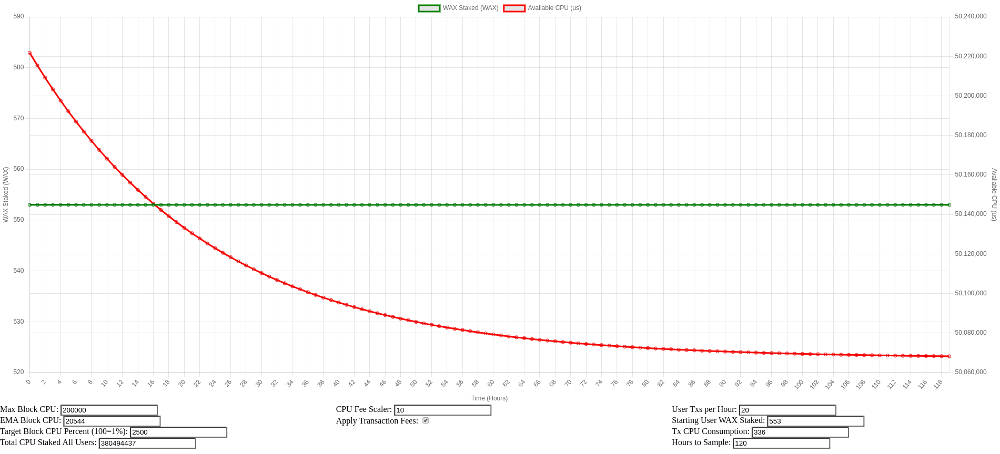  
Online Diagram at [here](https://raw.githack.com/worldwide-asset-exchange/wax-blockchain/tokenomics-graphs/graphs/stake-fee.html?inputHours=120&inputMaxBlockCPU=200000&inputFreeBlockCPUThreshold=0&inputCPUFeeScaler=10&inputEMABlockCPU=20544&inputTargetBlockCPUPct=2500&inputTxCPUConsumption=336&inputTxPerUserPerHour=20&inputTotalStakedAllUsers=380494437&applyTransactionFees=true&inputStartingWAXBalance=553)

  * Adjustments
    * Typical account executes 20 tx/hr
  * Result
    * The typical account is still able to execute 20 txs/hr indefinitely.

#### Base Case, 67% EMA, 20 txs/hr
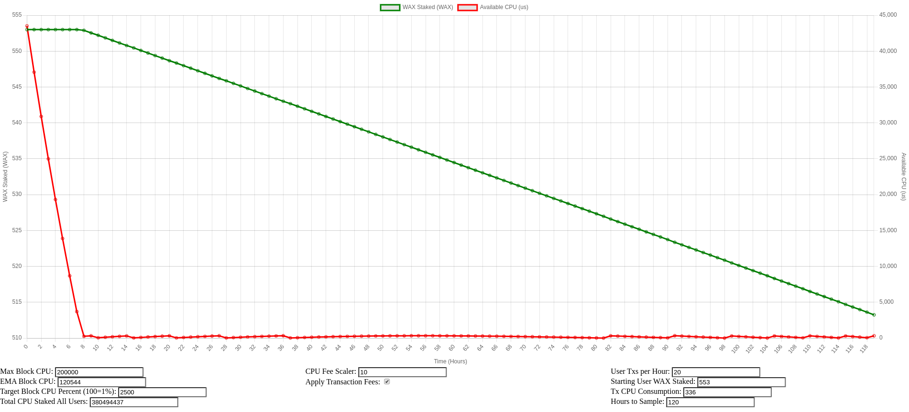 
Online Diagram at [here](https://raw.githack.com/worldwide-asset-exchange/wax-blockchain/tokenomics-graphs/graphs/stake-fee.html?inputHours=120&inputMaxBlockCPU=200000&inputFreeBlockCPUThreshold=0&inputCPUFeeScaler=10&inputEMABlockCPU=120544&inputTargetBlockCPUPct=2500&inputTxCPUConsumption=336&inputTxPerUserPerHour=20&inputTotalStakedAllUsers=380494437&applyTransactionFees=true&inputStartingWAXBalance=553)

  * Adjustments
    * Chain load (EMA Block CPU) is increased to 67% max capacity
    * Typical account executes 20 tx/hr.
  * Result
    * After about 8 hours, this account will have to pay fees to continue at this rate and under this chain load.

#### Base Case, +1B Stake
 
Online Diagram at [here](https://raw.githack.com/worldwide-asset-exchange/wax-blockchain/tokenomics-graphs/graphs/stake-fee.html?inputHours=120&inputMaxBlockCPU=200000&inputFreeBlockCPUThreshold=0&inputCPUFeeScaler=10&inputEMABlockCPU=20544&inputTargetBlockCPUPct=2500&inputTxCPUConsumption=336&inputTxPerUserPerHour=2&inputTotalStakedAllUsers=1380494437&applyTransactionFees=true&inputStartingWAXBalance=553)

  * Adjustments
    * Global CPU stake is increased by 1 billion WAX to 1380494437 WAX
  * Result
    * The typical account is still able to execute 2 txs/hr indefinitely.

#### Base Case, 67% EMA, +1B Stake
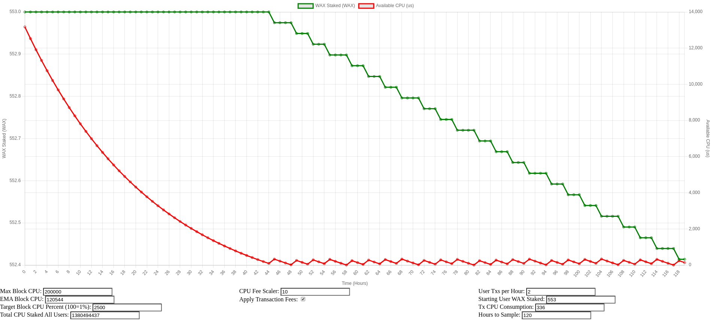 
Online Diagram at [here](https://raw.githack.com/worldwide-asset-exchange/wax-blockchain/tokenomics-graphs/graphs/stake-fee.html?inputHours=120&inputMaxBlockCPU=200000&inputFreeBlockCPUThreshold=0&inputCPUFeeScaler=10&inputEMABlockCPU=120544&inputTargetBlockCPUPct=2500&inputTxCPUConsumption=336&inputTxPerUserPerHour=2&inputTotalStakedAllUsers=1380494437&applyTransactionFees=true&inputStartingWAXBalance=553)

  * Adjustments
    * Global CPU stake is increased by 1 billion WAX to 1380494437 WAX
    * Chain load (EMA Block CPU) is increased to 67% max capacity
  * Result
    * After about 44 hours, this account will have to pay fees to continue sending at 2 tx/hr.

#### Base Case, 20 txs/hr, +1B Stake
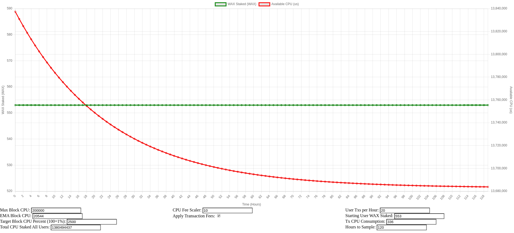 
Online Diagram at [here](https://raw.githack.com/worldwide-asset-exchange/wax-blockchain/tokenomics-graphs/graphs/stake-fee.html?inputHours=120&inputMaxBlockCPU=200000&inputFreeBlockCPUThreshold=0&inputCPUFeeScaler=10&inputEMABlockCPU=20544&inputTargetBlockCPUPct=2500&inputTxCPUConsumption=336&inputTxPerUserPerHour=20&inputTotalStakedAllUsers=1380494437&applyTransactionFees=true&inputStartingWAXBalance=553)

  * Adjustments
    * Global CPU stake is increased by 1 billion WAX to 1380494437 WAX
    * Typical account executes 20 tx/hr.
  * Result
    * The typical account is still able to execute 20 txs/hr indefinitely.

#### Base Case, 67% EMA, 20 txs/hr, 1B Stake
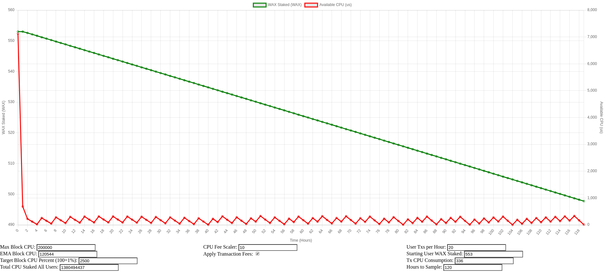 
Online Diagram at [here](https://raw.githack.com/worldwide-asset-exchange/wax-blockchain/tokenomics-graphs/graphs/stake-fee.html?inputHours=120&inputMaxBlockCPU=200000&inputFreeBlockCPUThreshold=0&inputCPUFeeScaler=10&inputEMABlockCPU=120544&inputTargetBlockCPUPct=2500&inputTxCPUConsumption=336&inputTxPerUserPerHour=20&inputTotalStakedAllUsers=1380494437&applyTransactionFees=true&inputStartingWAXBalance=553)

  * Adjustments
    * Global CPU stake is increased by 1 billion WAX to 1380494437 WAX
    * Chain load (EMA Block CPU) is increased to 67% max capacity
    * Typical account executes 20 tx/hr.
  * Result
    * After about 1 hour, this account will have to pay fees to continue sending at 20 tx/hr.

#### EOS Case
 
Online Diagram at [here](https://raw.githack.com/worldwide-asset-exchange/wax-blockchain/tokenomics-graphs/graphs/stake-fee.html?inputHours=120&inputMaxBlockCPU=200000&inputFreeBlockCPUThreshold=0&inputCPUFeeScaler=10&inputEMABlockCPU=20544&inputTargetBlockCPUPct=10&inputTxCPUConsumption=336&inputTxPerUserPerHour=2&inputTotalStakedAllUsers=380494437&applyTransactionFees=true&inputStartingWAXBalance=553)

This is called the EOS case as it mimics their chain settings for block CPU targets and consequently the elastic multiplier effect, which is effectively eliminated on EOS.
  * Adjustments
    * Target Block CPU Percent is set to 10 (== 0.1%), eliminating the elastic multiplier.
  * Result
    * The typical account is still able to execute 2 txs/hr indefinitely.

#### EOS Case, 20 txs/hr
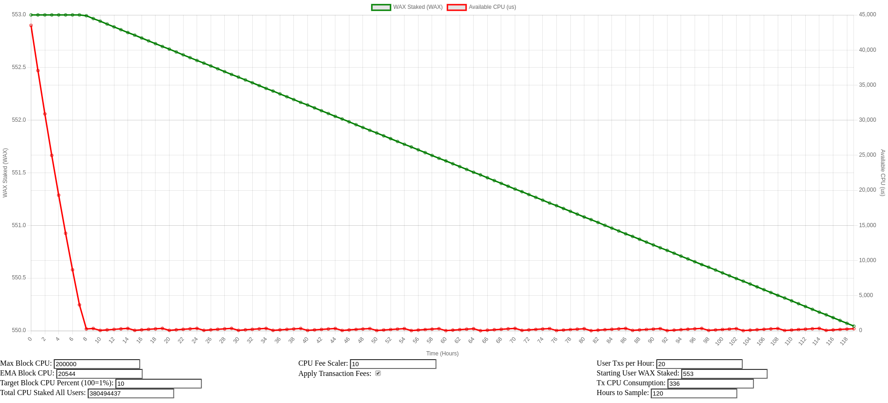 
Online Diagram at [here](https://raw.githack.com/worldwide-asset-exchange/wax-blockchain/tokenomics-graphs/graphs/stake-fee.html?inputHours=120&inputMaxBlockCPU=200000&inputFreeBlockCPUThreshold=0&inputCPUFeeScaler=10&inputEMABlockCPU=20544&inputTargetBlockCPUPct=10&inputTxCPUConsumption=336&inputTxPerUserPerHour=20&inputTotalStakedAllUsers=380494437&applyTransactionFees=true&inputStartingWAXBalance=553)

  * Adjustments
    * Target Block CPU Percent is set to 10 (== 0.1%), eliminating the elastic multiplier.
    * Typical account executes 20 tx/hr.
  * Result
    * After about 8 hours, this account will have to pay fees to continue sending at 20 tx/hr.

#### Aggressive User
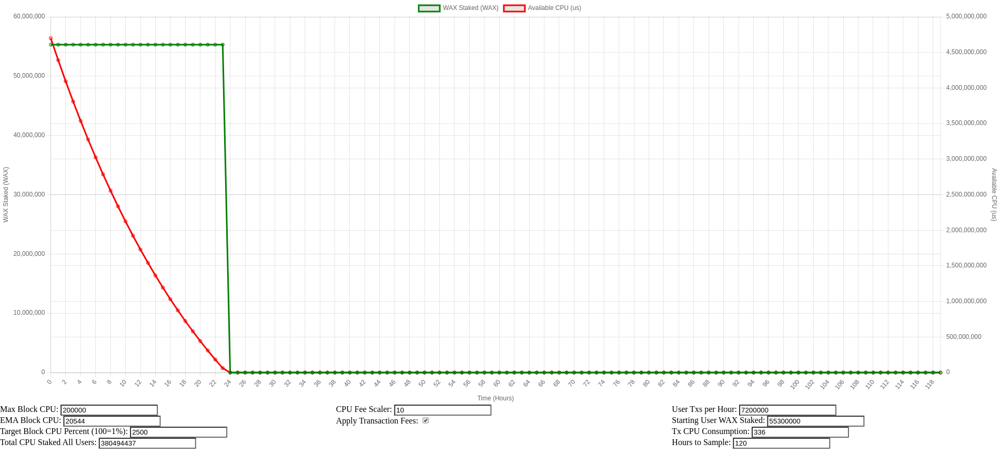 
Online Diagram at [here](https://raw.githack.com/worldwide-asset-exchange/wax-blockchain/tokenomics-graphs/graphs/stake-fee.html?inputHours=120&inputMaxBlockCPU=200000&inputFreeBlockCPUThreshold=0&inputCPUFeeScaler=10&inputEMABlockCPU=20544&inputTargetBlockCPUPct=2500&inputTxCPUConsumption=336&inputTxPerUserPerHour=7200000&inputTotalStakedAllUsers=380494437&applyTransactionFees=true&inputStartingWAXBalance=55300000)

This analysis is meant to demonstrate the edge case of a user with a lot of stake attempting to overwhelm the chain with transactions.
  * Adjustments
    * User has 55.3 Million WAX staked
    * Rich account executes 7200000 tx/hr (== 1000 tx/block)
  * Result
    * After about 24 hours, this account loses stake based access to resources and quickly loses all stake to fees, and is unable to execute more transactions

#### Aggressive User, EOS Case
 
Online Diagram at [here](https://raw.githack.com/worldwide-asset-exchange/wax-blockchain/tokenomics-graphs/graphs/stake-fee.html?inputHours=120&inputMaxBlockCPU=200000&inputFreeBlockCPUThreshold=0&inputCPUFeeScaler=10&inputEMABlockCPU=20544&inputTargetBlockCPUPct=10&inputTxCPUConsumption=336&inputTxPerUserPerHour=7200000&inputTotalStakedAllUsers=380494437&applyTransactionFees=true&inputStartingWAXBalance=55300000)

  * Adjustments
    * User has 55.3 Million WAX staked
    * Rich account executes 7200000 tx/hr (== 1000 tx/block)
  * Result
    * After about 24 hours, this account loses stake based access to resources and quickly loses all stake to fees, and is unable to execute more transactions (same as basechain case above)

### Observations
**Generosity of the Base Case**: The base case scenario is notably generous. Even with a modest stake of 553 WAX, an account can sustain a transaction rate of 2tx/hr indefinitely. While this fosters a welcoming environment for users, it may be excessively generous from a network sustainability and economics perspective. We should aim to pressure this range.

**Impact of Chain Load**: When the chain load is increased to 67% EMA, the impact on a basic user isn't immediate. However, when paired with a heightened transaction rate of 20 txs/hr, the system prompts for fees after 8 hours.

**Influence of Global Stake**: Upping the global CPU stake by 1 billion WAX reveals the system's dynamic nature. Alone, it doesn't hamper the base user. However, combined with a higher chain load, fees become essential after 44 hours. With an escalated transaction rate, this window reduces dramatically, especially with both an augmented chain load and transaction rate (fee initiation after just 1 hour).

**EOS Case**: Mimicking EOS settings by dropping the Target Block CPU Percent to a minimal level essentially neutralizes the elastic multiplier. This engenders a predictable environment, but it's the user's transaction rate that predominantly dictates fees, as observed in the "EOS Case, 20 txs/hr."

**Aggressive User Dynamics**: Should an account with an extensive stake try to flood the chain, system defenses activate. This user rapidly depletes their resources, facing fees, and experiences a complete transaction halt within 24 hours. This steadfast defense remains consistent even in the EOS configuration, showcasing the resource system's resilience against potential high-stake abuse.

### Implications
**Fine-Tuning the Base Case**: While being user-centric is vital for adoption and usability, the current base case seems overly indulgent. A revision is needed to strike a balance, ensuring a reasonably low-cost range without being overly munificent. Most likely we either increase the system stake, or we drop the target block CPU percent gradually to squeeze this range

**System Robustness**: The WAX resource system exhibits durability and versatility across varied conditions, from different chain loads, staking amounts, and transaction velocities.

**Guarding Against Exploitation**: Independent of specific settings or the amount staked, the system is engineered to thwart any single user from saturating the chain with exorbitant transactions.

**EOS Benchmark**: Mirroring EOS settings renders a more transparent resource management paradigm. Yet, this doesn't compromise the system's inherent defense against high-stake, high-transaction rate users.

To ensure the long-term sustainability and economic viability of the network, a reconsideration of the base case's generosity is crucial. Adjustments should aim to maintain a user-friendly demeanor, but not to the point of compromising the network's fiscal health.
